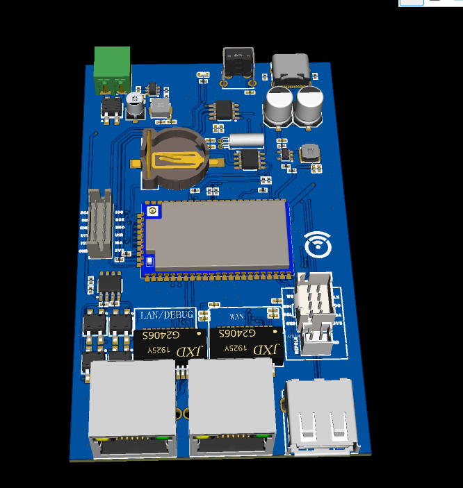

# 说明

为减少成本，硬件并未进行ESD防护与各种其它保护措施(如USB防电流倒灌)。

一般仅用于原理验证，生产环境请谨慎使用。

# 文件说明

## 2024-04-29

### 立创EDA(专业版)工程

[CoreBoard-001_2024-04-29.epro](CoreBoard-001_2024-04-29.epro)

### 原理图

[SCH_Schematic-CoreBoard-001_2024-04-29.pdf](SCH_Schematic-CoreBoard-001_2024-04-29.pdf)

注意:具体原理图请查看立创EDA(专业版)工程。

### PCB

注意:具体PCB板请查看立创EDA(专业版)工程。